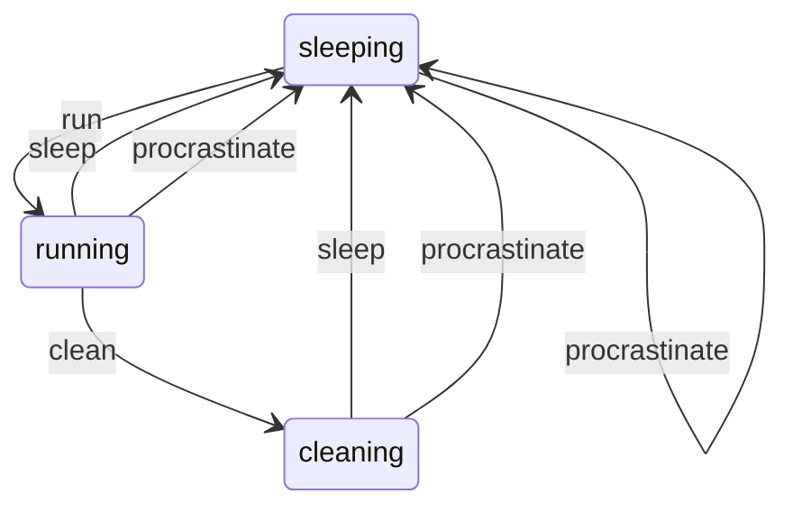

# AASMMermaid

Generate [Mermaid](https://github.com/mermaid-js/mermaid) diagrams from [AASM](https://github.com/aasm/aasm) state machines.

## Installation

Add this line to your application's Gemfile:

```ruby
gem 'aasm_mermaid'
```

And then execute:

    $ bundle install

Or install it yourself as:

    $ gem install aasm_mermaid

## Usage

for an example AASM:

```ruby
class TestAASMParentClass
  include AASM
  attr_accessor :state

  aasm do
    state :sleeping, initial: true
    state :running, :cleaning

    event :run do
      transitions from: :sleeping, to: :running
    end

    event :clean do
      transitions from: :running, to: :cleaning
    end

    event :sleep do
      transitions from: %i[running cleaning], to: :sleeping
    end

    event :procrastinate do
      transitions to: :sleeping
    end
  end
end
```

generate the diagram with:
```ruby
AASMMermaid.generate_diagram_for(aasm: TestAASMParentClass.aasm)
```

result ([rendered by github](https://github.blog/2022-02-14-include-diagrams-markdown-files-mermaid/)):



## Development

After checking out the repo, run `bin/setup` to install dependencies. Then, run `rake spec` to run the tests. You can also run `bin/console` for an interactive prompt that will allow you to experiment.

To install this gem onto your local machine, run `bundle exec rake install`.

## Contributing

Bug reports and pull requests are welcome on GitHub at https://github.com/iiwo/aasm_mermaid.
This project is intended to be a safe, welcoming space for collaboration,
and contributors are expected to adhere to the [code of conduct](https://github.com/[USERNAME]/aasm_mermaid/blob/master/CODE_OF_CONDUCT.md).

## License

The gem is available as open source under the terms of the [MIT License](https://opensource.org/licenses/MIT).

## Code of Conduct

Everyone interacting in the AASMMermaid project's codebases, issue trackers, chat rooms and mailing lists is expected to follow the [code of conduct](https://github.com/[USERNAME]/aasm_mermaid/blob/master/CODE_OF_CONDUCT.md).
